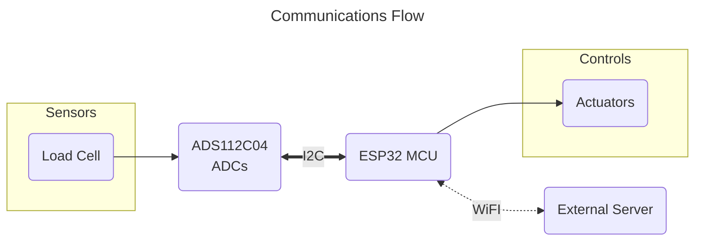
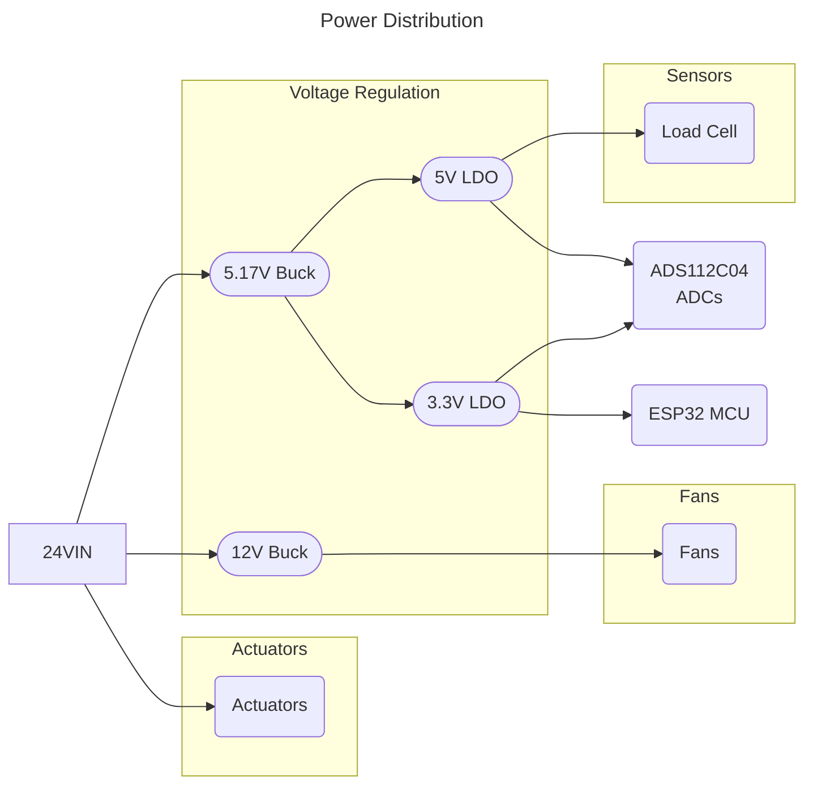

# GSE Control Node

The GSE control node is the control PCB for GSE systems to integrate with launch control. This includes actuator control, fan control, and a load cell reading. This control node is used for control of the GSE equipment on the launch tower.

## System Architecture

Control nodes use an ESP32S3-WROOM-1U microcontroller for systems control. This ESP32S3 communicates with an external control
server to for remote control and data streaming over 2.4GHz WiFi. All commands are sent from the external server, as
control nodes does not autonomously control any systems.

A communications diagram for the GSE control node can be seen below.

## Power Architecture

The GSE control node operates from a 24VDC power supply. The 24V rail is first stepped down to 5.17V with a switching converter and then dropped to 5V and 3.3V with LDOs. The 5V rail supplies analog systems, and the 3.3V rail supplies digital systems. Using LDOs on the switching output allows for low-noise power for analog measurements. There is also a switching converter to step the 24V rail down to 12V, to power fans.

## Required Software

This project was created using KiCad v10.0. If manufacturing with JLCPCB, install the Fabrication Toolkit KiCad plugin for JLCPCB.

## Recommended Manufacturing Options

If ordering from JLCPCB, use the JLC04161H-3313 stackup option. For JLC PCBA, the standard PCBA option is required due
to the ESP32S3-WROOM-1U being unavailable as a part in the economic PCBA assembly.
